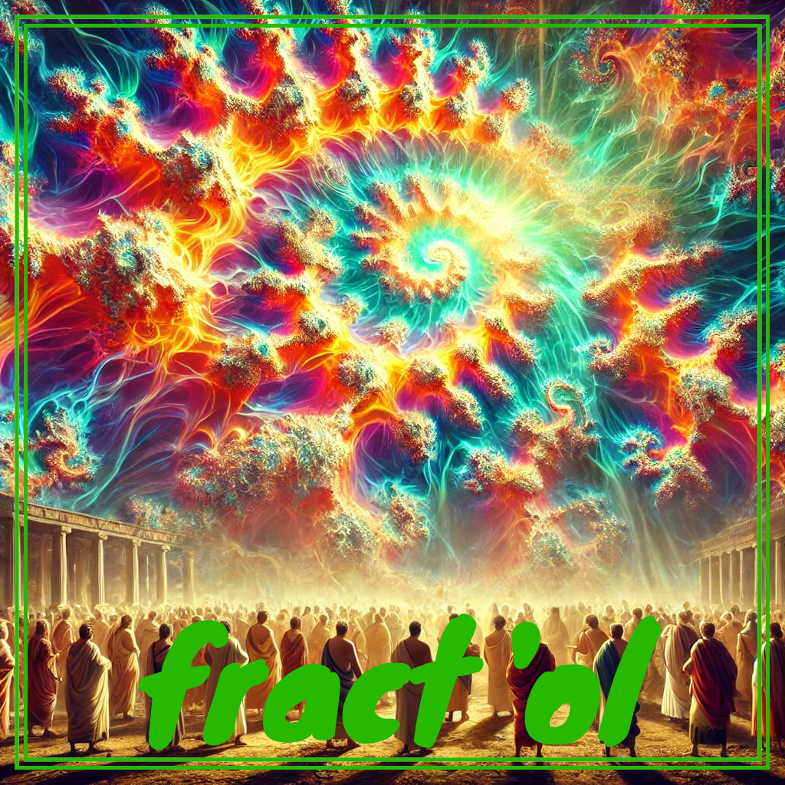
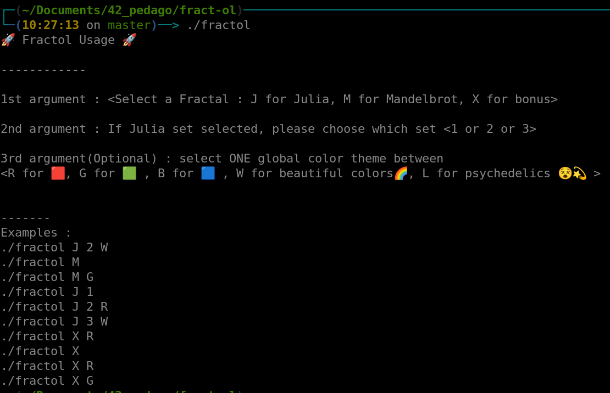

<p align="center">
  
</p>

## 🚀 SYNOPSIS

The `fract'ol` project at 42 school immerses students in the realm of fractal exploration within the C language. This creative endeavor beckons an in-depth understanding of complex mathematical structures and graphical rendering techniques.

Students are tasked with crafting a program that generates and visually renders diverse fractal patterns, delving into the intricate beauty of mathematical artistry.
Beyond the surface, fract'ol serves as a canvas for honing skills in interactive user interfaces, and the manipulation of complex numerical computations.

Leveraging the [MiniLibX](https://github.com/42Paris/minilibx-linux) library, this project seamlessly integrates graphics capabilities, providing students with a versatile toolset for creating visually stunning fractal representations.

MLX is a lightweight library designed for simple 2D graphics rendering, offering functions for creating windows, drawing pixels, and handling events like keyboard and mouse input.

Successfully completing this project not only showcases prowess in graphics programming but also underscores a profound appreciation for the intersection of mathematics and computer science in producing visually captivating results.

## 🛠️ PROGRAM SPECIFICITIES AND CONSIDERATIONS

Start my cloning the repo locally :

```bash
git clone git@github.com:maitreverge/fract-ol.git
```

Then compile the projet by running the MakeFile :

```bash
make
```

> [!WARNING]
> This project aims to be executed in a x86 Linux environment, with a QWERTY keyboard.


## ⚙️ USAGE

When you launch first the `fractol` binary, you'll have a guide on how to use the binary :

<p align="center">
  
</p>


## 🎛️ CONTROLS

#### KEYBOARD
- `M` key : Hot-swap for MandelBrot
- `J` key : Hot-swap for Julia
- `X` key : Hot-swap for Unicorn
- `1` key : Color hot-swap : Black&White 
- `2` key : Color hot-swap : Red
- `3` key : Color hot-swap : Green
- `4` key : Color hot-swap : Blue
- `5` key : Color hot-swap : WOW
- `6` key : Color hot-swap : LSD
- `+` key : More definition (slows down the zoom rendering) 
- `-` key : Less definition
- Arrow key : Moves the fractal in 4 axis.

#### MOUSE
- RIGHT CLICK : Light color shift
- LEFT CLICK : Swap Julia sets (works only when Julia is already displayed).
- SCROLL UP : Zoom in.
- SCROLL DOWN : Zoom out.


## 🤝 CONTRIBUTION
Contributions are open, open a Github Issue or submit a PR 🚀
